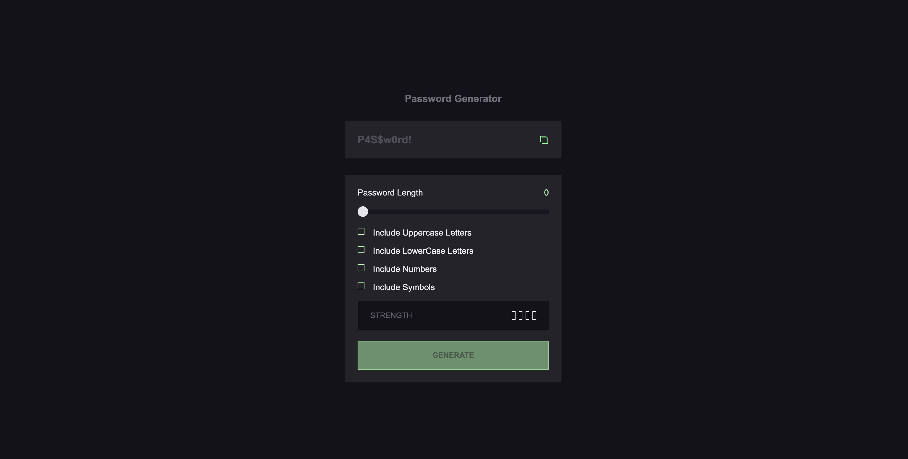
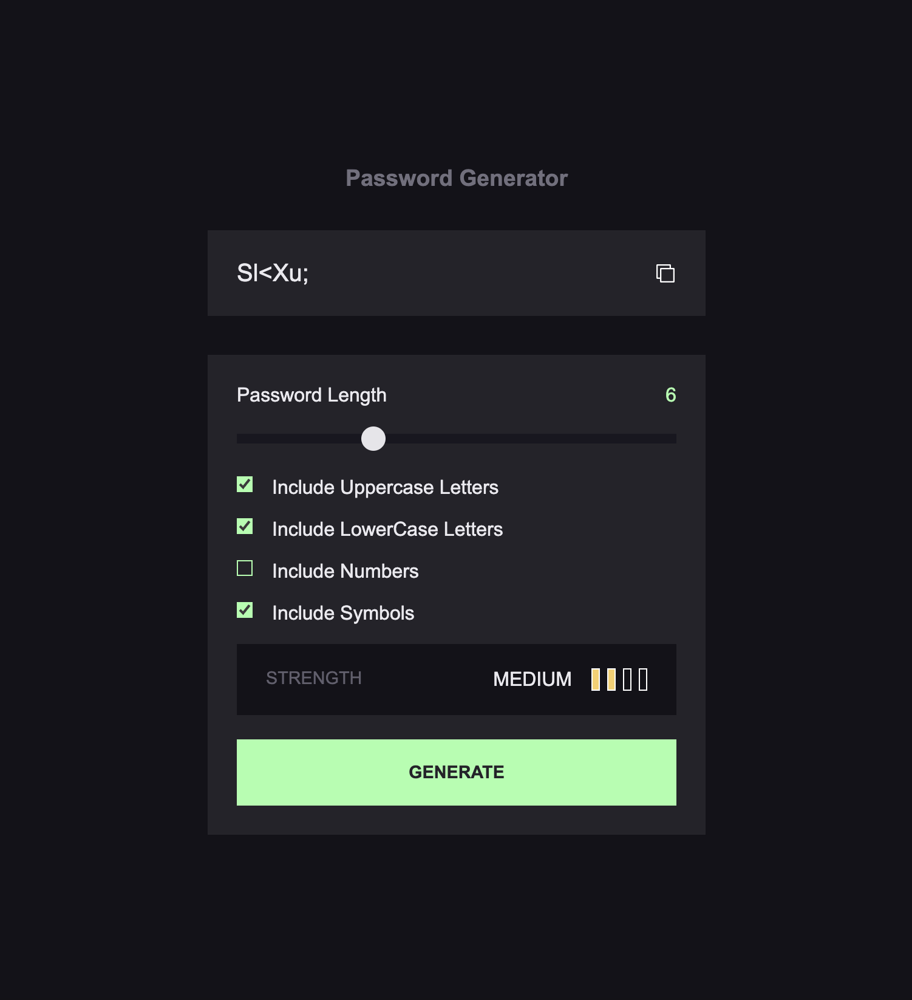
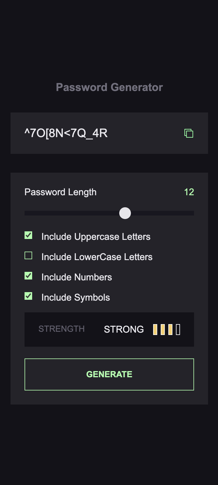

# Password Generator (Intermediate)

This is a solution to the [Password Generator on Frontend Mentor](https://www.frontendmentor.io/challenges/password-generator-app-Mr8CLycqjh). 

## Table of contents
- [The challenge](#the-challenge)
- [Built with](#built-with)
- [What I learned](#what-i-learned)
- [Continued development](#continued-development)
- [Useful resources](#useful-resources)
- [Screenshots](#screenshots)

### The challenge

Users should be able to:

- Generate a password based on the selected inclusion options
- Copy the generated password to the computer's clipboard
- See a strength rating for their generated password
- View the optimal layout for the interface depending on their device's screen size
- See hover and focus states for all interactive elements on the page

### Built with

- Semantic HTML5 markup
- CSS custom properties
- Flexbox
- Media Queries
- Vanilla JavaScript ES6+
- Desktop-first workflow

### What I learned

- How to convert Unicode values to the equivalent String, using ```String.fromCharCode() ```
- How to copy text to clibpoard
- How to create a custom range input that looks consistent across all browsers

### Continued development

- Change the color of the portion of the progress bar corresponding to the selected value

### Useful Resources

- [Convert Hex colors to CSS filter]https://www.smashingmagazine.com/2021/12/create-custom-range-input-consistent-browsers/

### Screenshots




